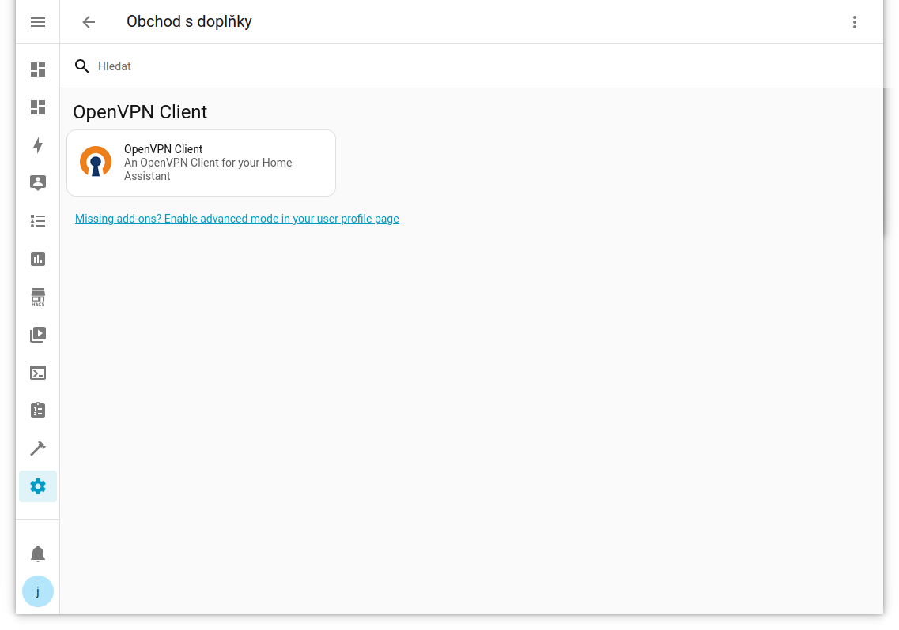
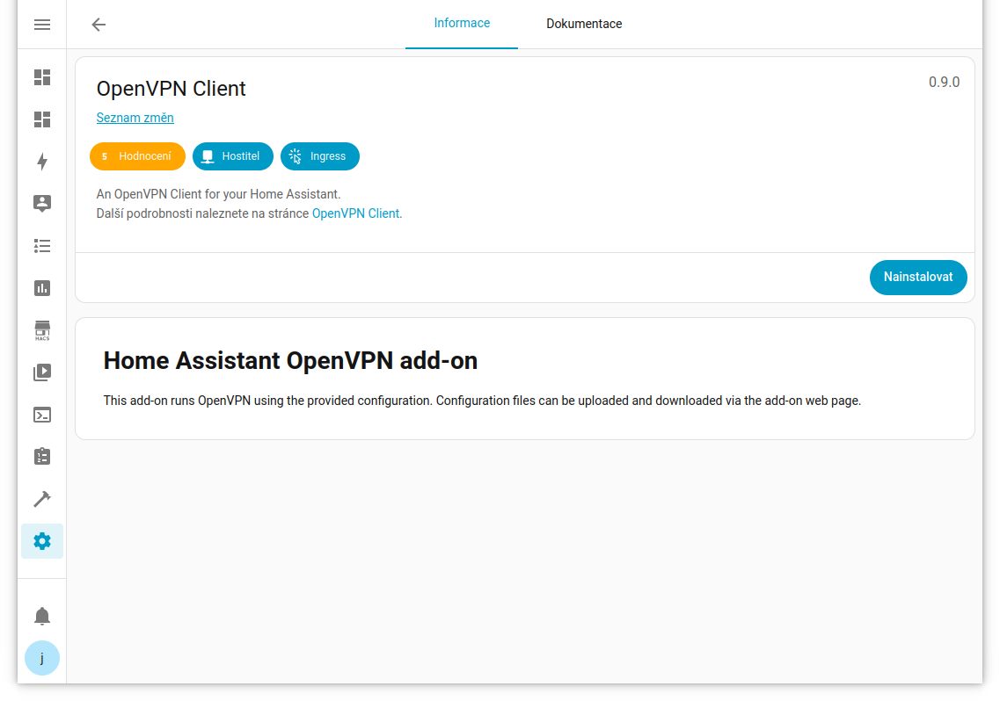
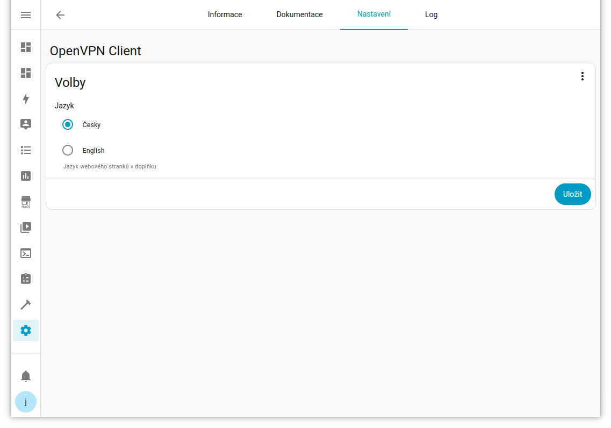
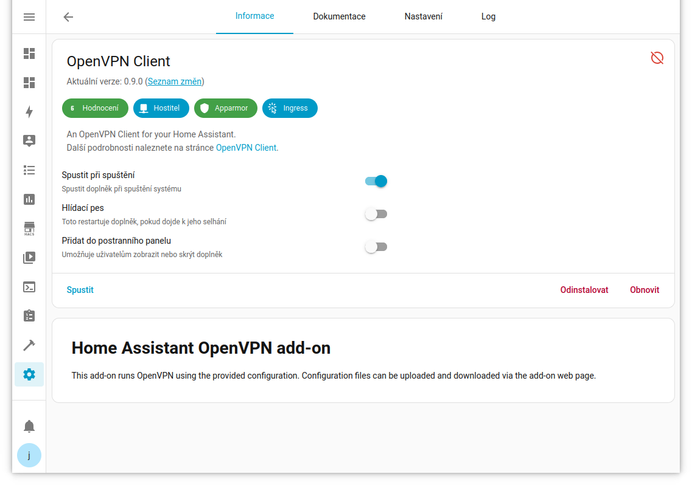
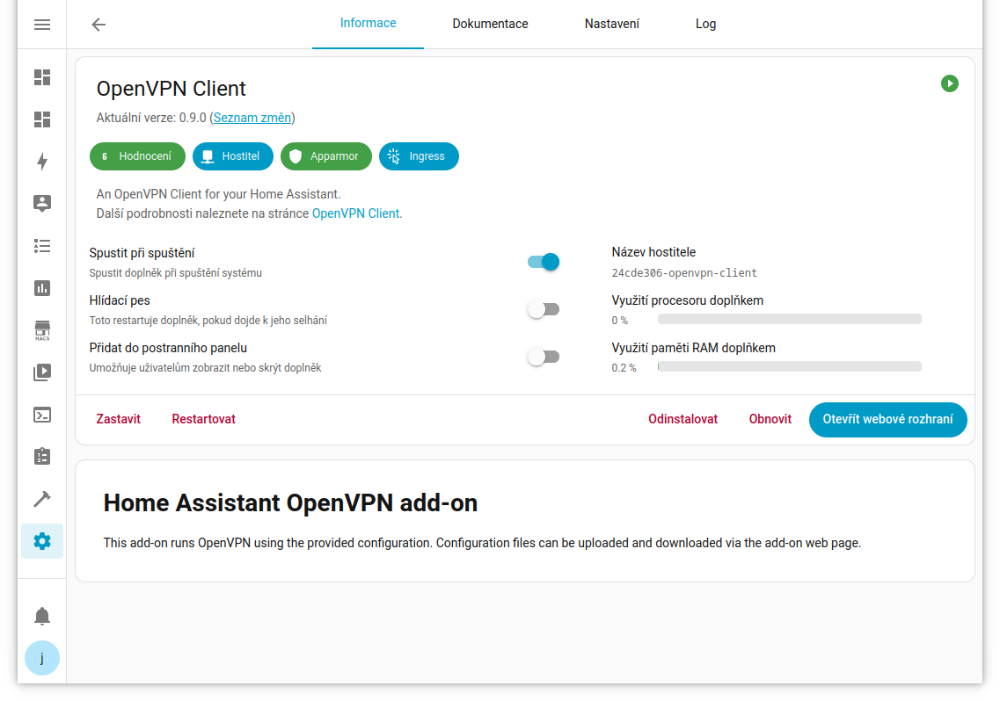
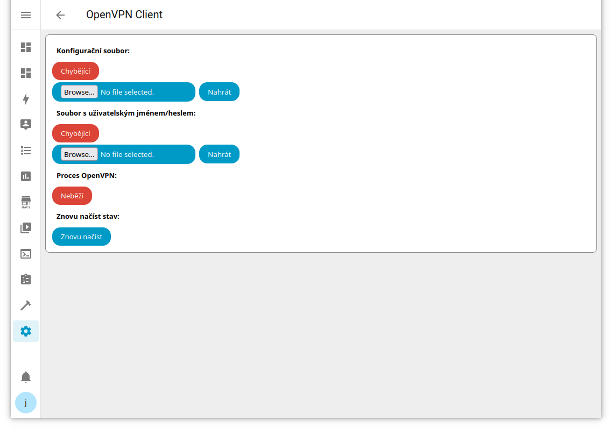
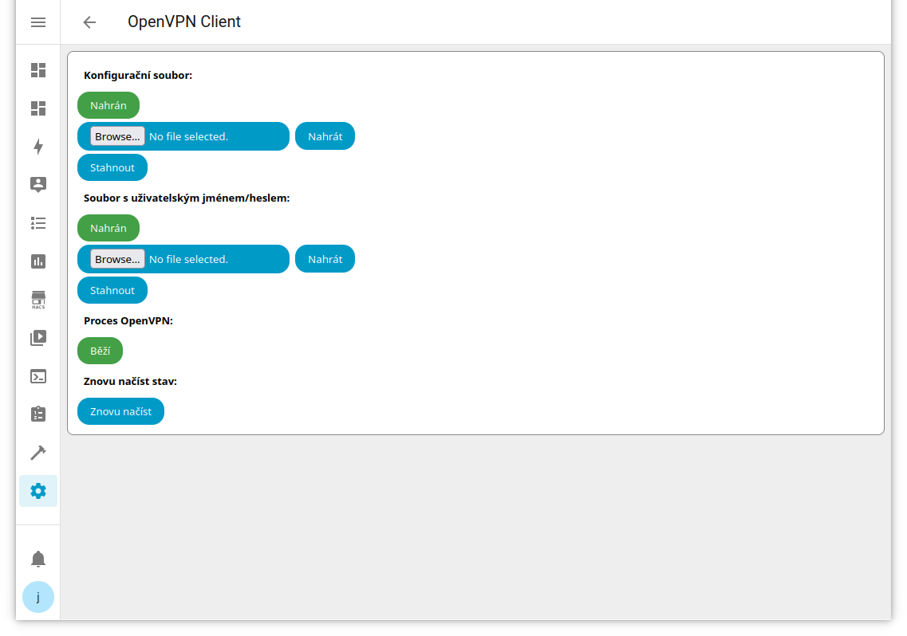
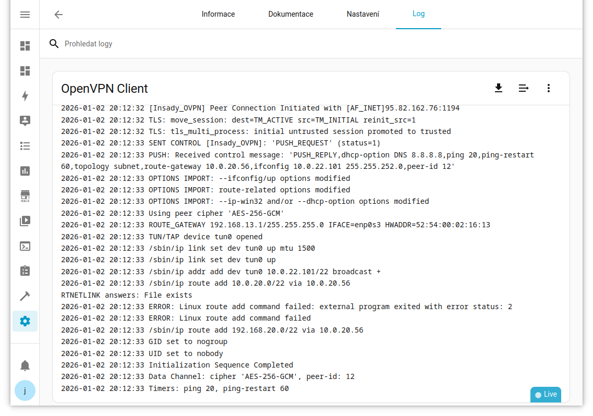

Home Assistant OpenVPN Client add-on
====================================

Tento doplněk spouští OpenVPN pomocí poskytnuté konfigurace.  Konfigurační soubory lze nahrát a stánout na webové stránce doplňku.

Instalace doplňku
-----------------

Doplněk lze nainstalovat buď z GitHubu, nebo z obchodu s doplňky Home Assistant.

Pro instalaci z GitHub navštivte:

- https://github.com/julian-coleman/home_assistant_add-ons

a klikněte na tlačitko **Add Add-on Repository to My HA**.  Držte se pokyny a dostanete se do dialogového okna Repozitáře v obchodě s doplňky:

[]

Pro instalaci z Obchodu s doplňky v Home Assistant, navštivte **Nastavení**, **Doplnky**, **Obchod s doplnky** a pak z menu v pravém horním rohu **Repozitáře**.  Vyplňte URL adresu repozitáře:

- https://github.com/julian-coleman/home_assistant_add-ons

[]

Pro obě vyberte **+ Přidat** a pak **Zavřít**.  Znovu načtěte stránku a doplněk OpenVPN Client bude k dispozici:

[]

Vyberte **OpenVPN Client** a pak **Nainstalovat**:

[]

Můžete změnit jazyk na kartě **Nastavení**:

[]

Jestli se zmení jazyk po spuštení doplňku, použijte tlačítko **Znovu načíst** v stránce **Otevřit webové rozhraní**.

Po instalaci doplňku **Spustit** doplňek:

[]

a **Otevřít webové rozhraní**:

[]

Konfigurace doplňku
-------------------

Webové rozhraní zobrazuje stav souborů OpenVPN a proces OpenVPN. Dva soubory jsou hlavní konfigurační soubor (.ovpn) a soubor s uživatelským jménem/heslem (.text):

[]

Pro každý soubor použijte **Browse** k výběru souboru v lokálním souborovém systému a pak jeho **Nahrát**:

Doplněk každou minutu kontroluje konfigurační soubory a po jejich nalezení spustí OpenVPN.  Po nahrání souborů by se OpenVPN měl spustit do minuty.  Aktuální stav lze zkontrolovat pomocí tlačítka **Znovu načíst**:

[]

Pokud se konfigurační soubory změní, doplněk OpenVPN automaticky nerestartuje. **Restartovat** z hlavní stránky doplňku, abyste doplněk restartovali s novou konfigurací.

Logy doplňku
------------

Doplněk zaznamenává svůj aktuální stav do logu. Když jsou konfigurační soubory k dispozici a OpenVPN je spuštěn, OpenVPN zaznamenává stav do logu. Do logu budou také zapsány všechny chyby OpenVPN:

[]
