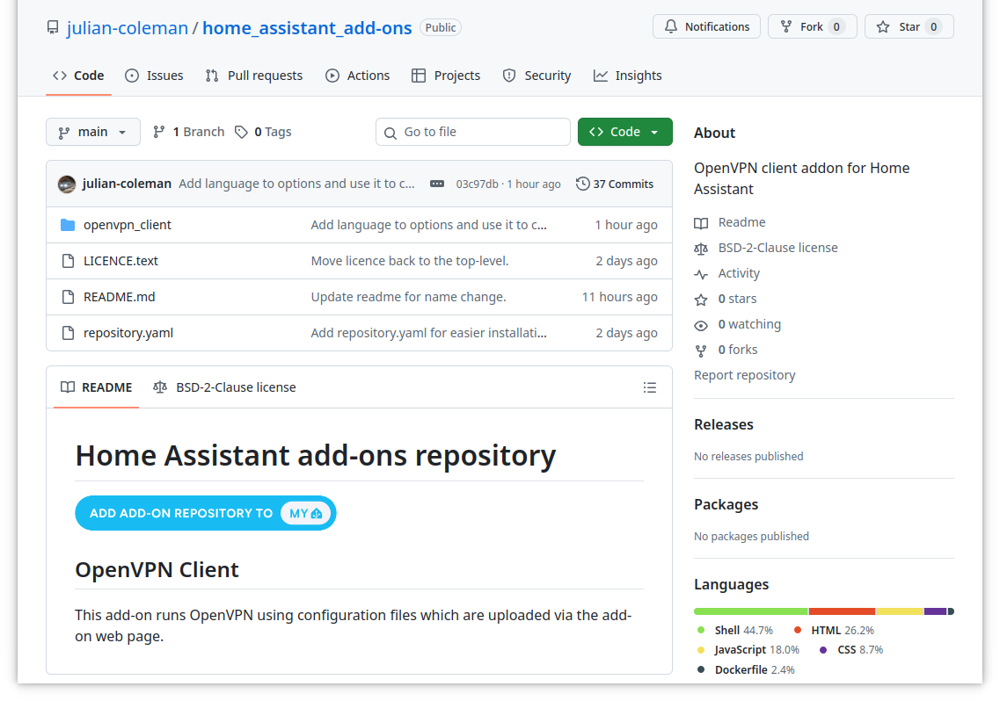
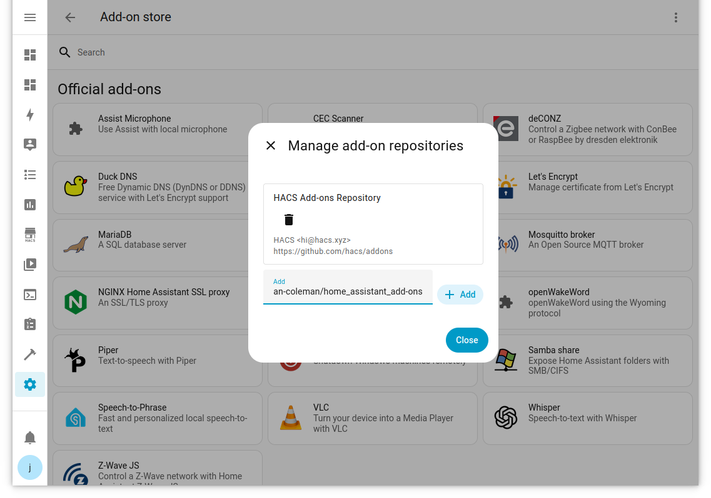
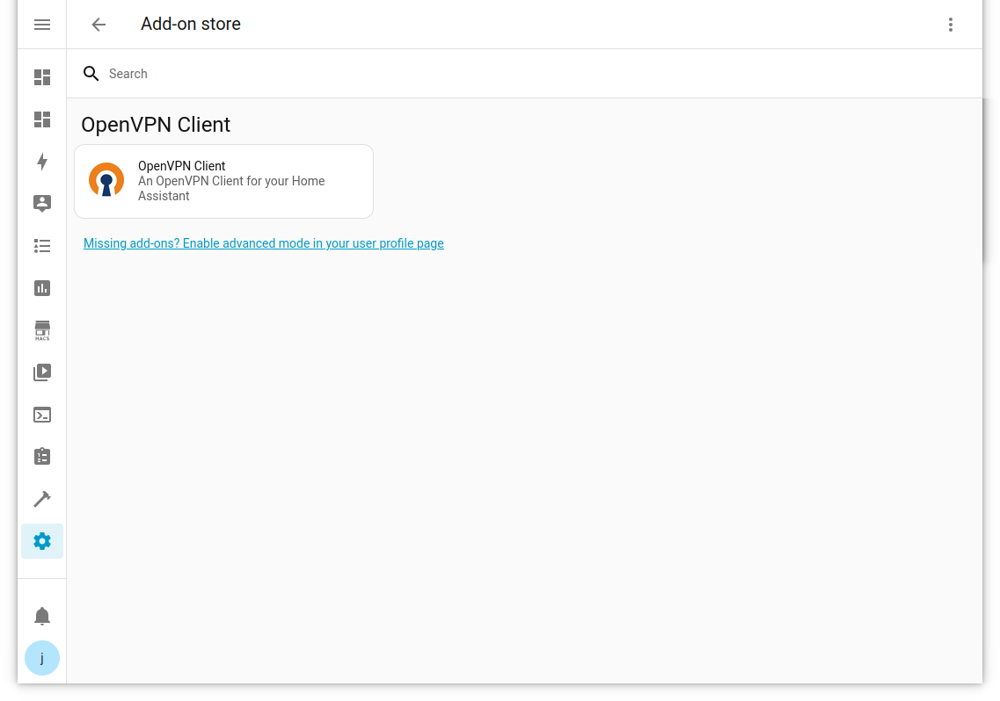
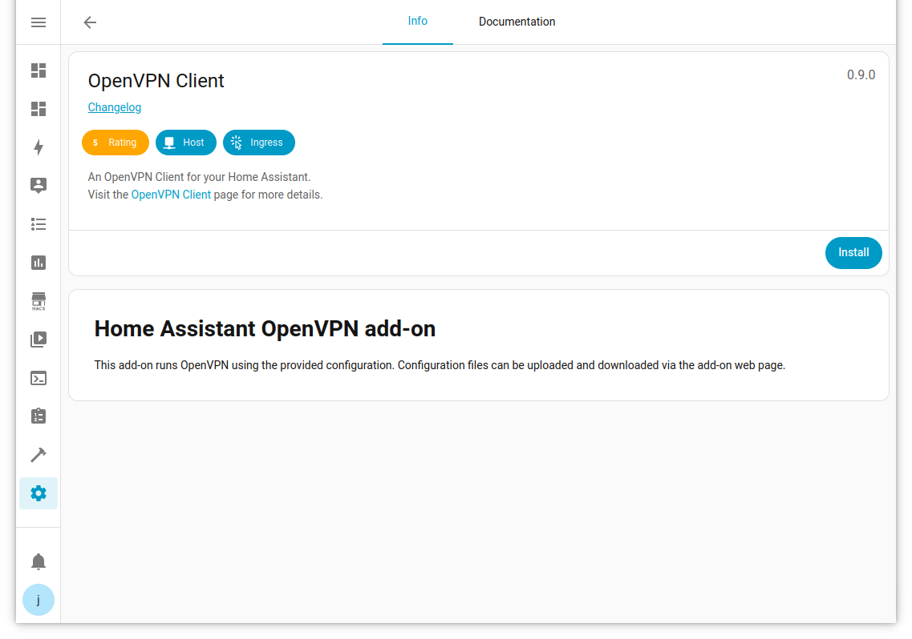
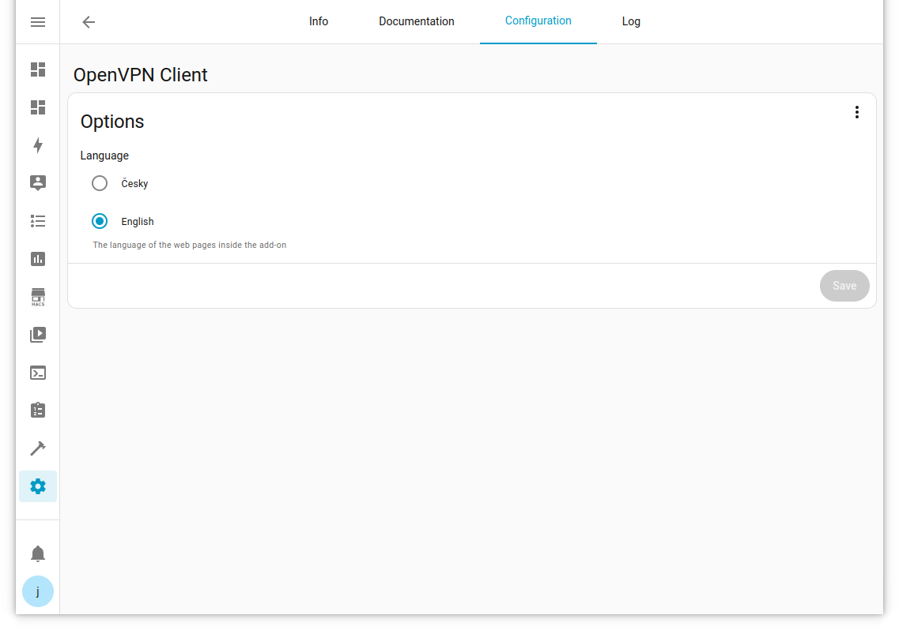
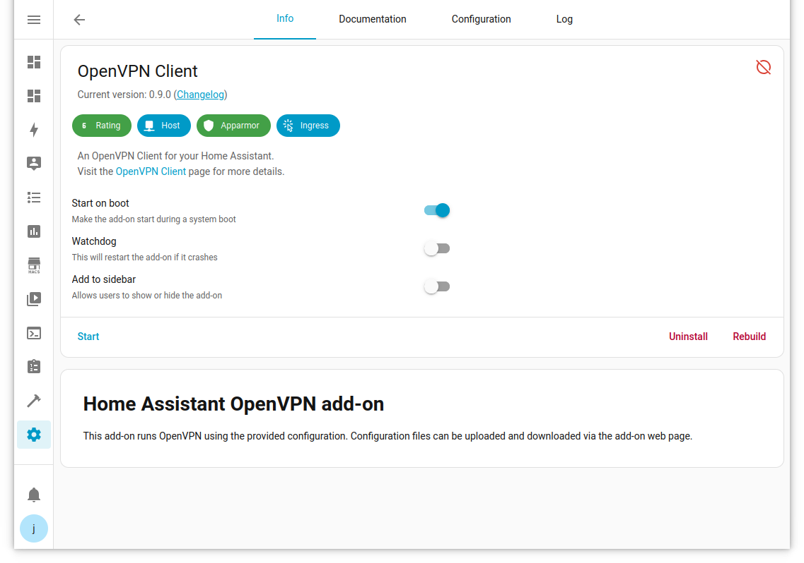
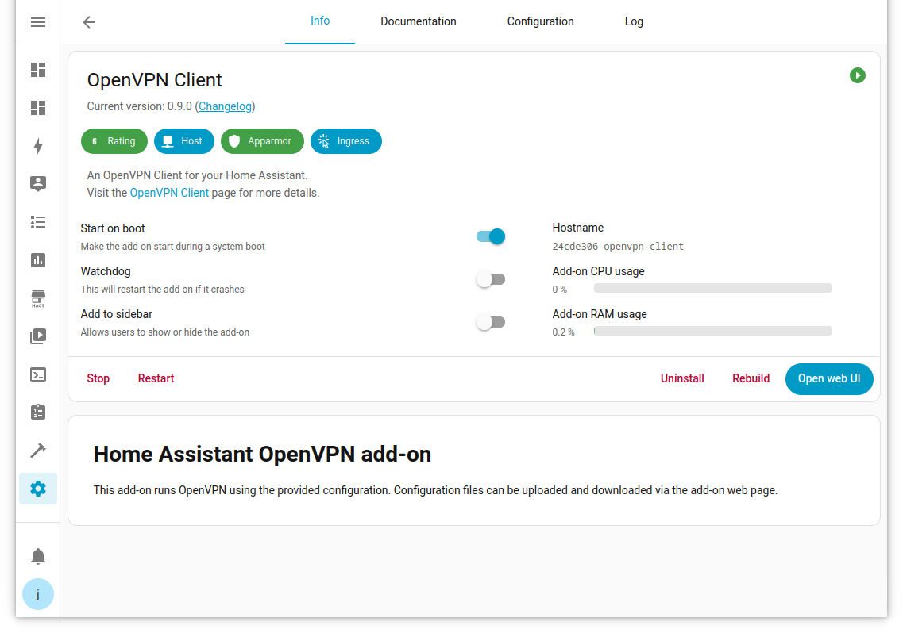
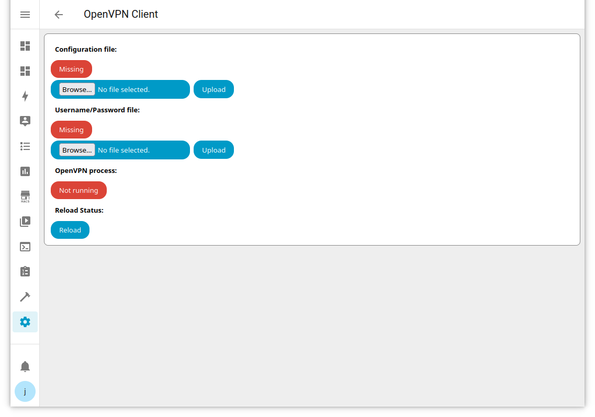
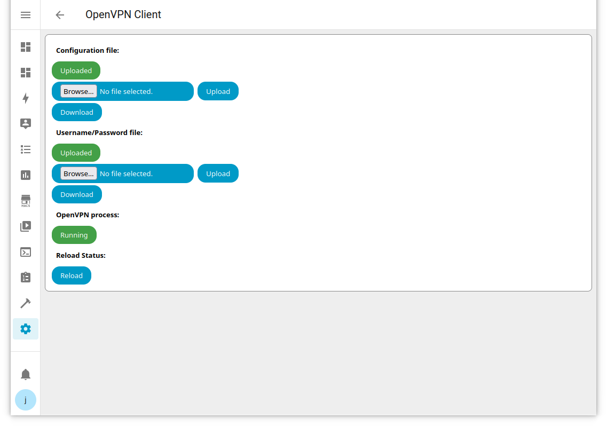
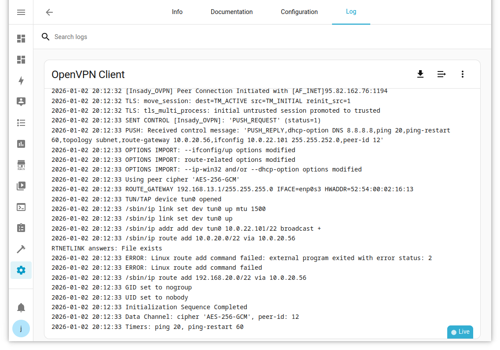

Home Assistant OpenVPN Client add-on
====================================

This add-on runs OpenVPN using the provided configuration. Configuration files can be uploaded and downloaded via the add-on web page.

Add-on Installation
-------------------

The add-on can be installed either from github or from the Home Assistant Add-on store.

To install from github, visit:

- https://github.com/julian-coleman/home_assistant_add-ons

and click the **Add Add-on Repository to My HA** button.  Follow the prompts and this will take you to the Add-on store Repositories dialog:

To install from the Home Assistant Add-on store, visit **Settings**, **Add-ons**, **Add-on store**, and then **Repositories** from the top-right menu.  Fill in
the repository URL:

- https://github.com/julian-coleman/home_assistant_add-ons

For both methods, select **+ Add**, then **Close**.  Reload the page and the OpenVPN Client add-on will be available:

Select the **OpenVPN Client** and then **Install**:

Optionally change the language in the **Configuration** tab:

If the language is changed after the add-on has been started, use the **Reload** button in the **Open web UI**.

After the add-on is installed, **Start** the addon:

and **Open web UI**:

Add-on Configuration
--------------------

The web UI shows the status of the OpenVPN files and the OpenVPN process.  The two files are the main configuration file (.ovpn) and the username/password file (.text):

For each file, use **Browse** to select the file on the local file system, then **Upload** it.

The add-on checks every minute for configuration files and starts OpenVPN when they are found.  After the files are uploaded, OpenVPN should start within a minute.  The current status can be checked using the **Reload** button:

If the configuration files are changed, the add-on will not automatically restart OpenVPN.  **Restart** from the main add-on page to restart the add-on with the new configuration.

Add-on Logs
-----------

The add-on outputs its current status to the log.  When the configuration files are available and OpenVPN is running, the OpenVPN output is displayed in the log.  Any OpenVPN errors will also be written to the log:

